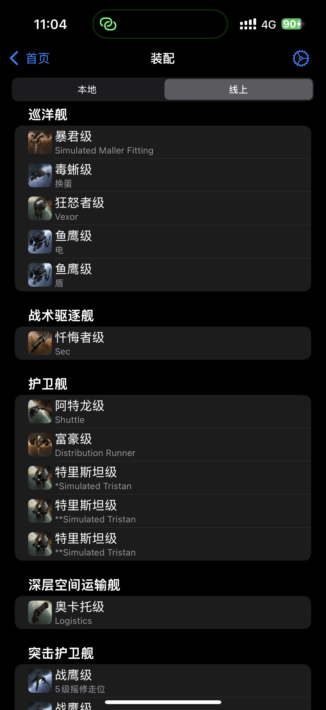
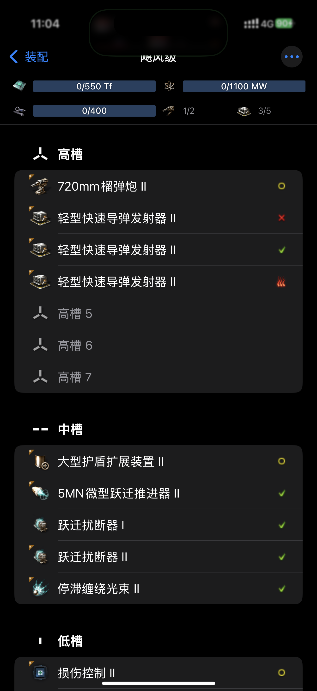
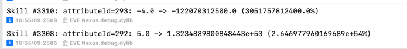

# 开发进度 / In progress

## 装配模拟

1. 能够查看线上装配
2. 能够新增、调整本地装配
3. 能够添加装备，设置装备激活、启用、离线、超载状态
4. 能够显示船体CPU、PG、炮台和发射器数
5. 设计了更合理的安装逻辑，不会安装错误的装备（如不应将小型改装件装在中型舰船上，不应将旗舰装备装在常规舰船上等）
6. 补充了更多特殊装配规则，如：隐秘行动等装备只能装在部分舰船上，微曲装备只能同时运行一个，等等。
7. 开发中：数值模拟

## 05-27 16:59:39

完成了以下数值模拟的内容：
1. 根据子系统修正炮台数、槽位数
2. 根据装备状态计算资源占用
3. 根据堆叠属性计算是否要设置惩罚
4. 根据属性关系计算最终抗性等数值
5. 根据技能计算各属性数值
6. 根据装备启停状态计算加成效果

待实现：
1. 根据植入体和环境设置加成
2. 电容器稳定度

bug：
1. 为什么我算出来了一坨非常离谱的加成
